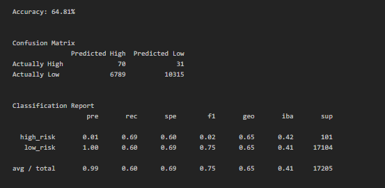
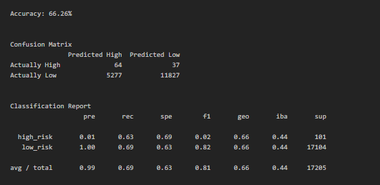
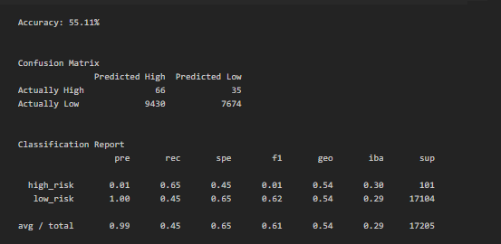
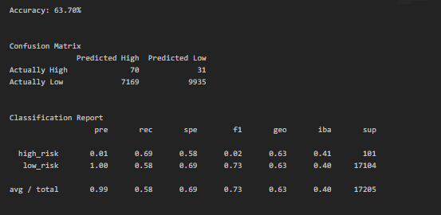
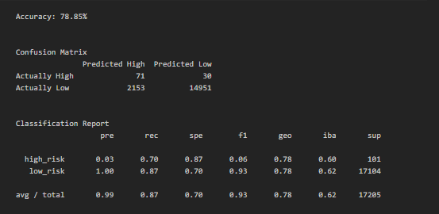
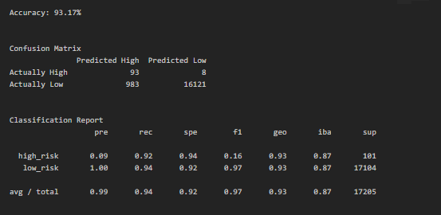

# Credit Risk Analysis: Analyzing resampling techniques to create a machine learning model

## Overview
Fast Lending wants to use machine learning to predict which clients are likely to pay back their loans and which are likely to default.  The data set has a small number of bad debts. Most people have been able to pay the funds back. To analyze the data and develop a machine learning model I tested various resampling methods to assess their accuracy. Two ensemble models would also be tested against the data.  With the results obatained we should be able to determine which models if any can be used to predict credit risk from the dataset.

## Results

- Model A: Accuracy-64.81%, High Risk Precision-1%, High Risk Recall-69%,
Low Risk Precision-100%, Low Risk Recall-60%

**Image 1:** Model A - Logistic regression model with naive random oversampling.

- Model B: Accuracy-66.26%, High Risk Precision-1%, High Risk Recall-63%,
Low Risk Precision-100%, Low Risk Recall-69%

**Image 2:** Model B - Logistic regression model with SMOTE oversampling.

- Model C: Accuracy-55.11%, High Risk Precision-1%, High Risk Recall-65%,
Low Risk Precision-100%, Low Risk Recall-45%

**Image 3:** Model C - Logistic regression model with cluster centroids undersampling.

- Model D: Accuracy-63.70%, High Risk Precision-1%, High Risk Recall-69%,
Low Risk Precision-100%, Low Risk Recall-58%

**Image 4:** Model D - Logistic regression model with SMOTEENN combined over- and undersampling.

- Model E: Accuracy-78.85%, High Risk Precision-3%, High Risk Recall-70%,
Low Risk Precision-100%, Low Risk Recall-87%

**Image 5:** Model E - Balanced Random Forest Classifier model.

- Model F: Accuracy-93.17%, High Risk Precision-9%, High Risk Recall-92%,
Low Risk Precision-99%, Low Risk Recall-94%

**Image 6:** Model F - Easy Ensemble AdaBoost Classifier model.

## Summary
### Sampling Methods
 Models A, B, C, and D sampling methods similar outcomes.  Naïve sampling (Model A) performed the best of the four models, because it had an equivalent precision and recall for the High Risk group as the next best model (Model D), but is showed higher Recall for the Low Risk group than Model D.  Model B (SMOTE oversampling) showed higher recall for the Low Risk group than Model A, however it showed lower recall for the High Risk group than Model A.  For this use case, models should be optimized for detecting High Risk over Low Risk, so Model A is still a better choice than Model B.  Model C (undersampling) showed the worst performance of the logistic models, with midrange recall for High Risk and the lowest recall for Low Risk, and the lowest accuracy of any model tested.  Thus, naïve random sampling was the best sampling resampling method for this data set, with an added bonus of running faster than the techniques that implemented SMOTE techniques.
### Model Choice
The model that performed the best was Model F (Easy Ensemble AdaBoost Classifier), with a recall of 92% and precision of 9% for High Risk and precision of 99% and recall of 94% for Low Risk, leading to a model with an overall accuracy of 93%.  This is a high performing model given that the threshold for a stout model is 70%.  
